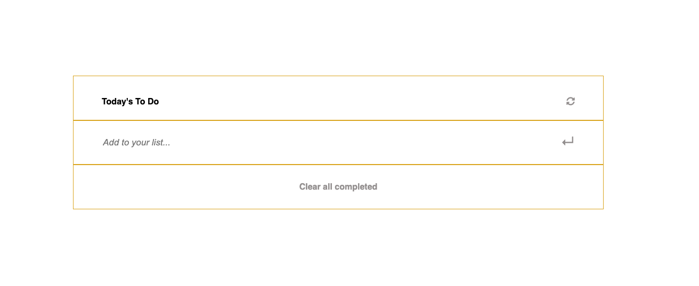

# Best Practices Test

> Basic website that allows users to add/remove tasks from a list. They can further go and mark the ones that are completed. This project focuses on testing the functionality of these tasks and looking at the coverage level for each task. The Basic task functions should be to add and remove a particular task. Also to do the same in a fake localStorage for the program to check.

## Built With

- Javascript
- HTML
- CSS
- Webpack
- JEST



## Getting Started

To get a local copy up and running follow these simple example steps.

### Setup

Run 

```bash
# To clone the git repositories
git clone https://github.com/GintsM/JS-best-practices-test.git

# To install dependencies 
npm install 

# To run development branch
npm run start
```

### Run tests

For Linters:

```bash
# To check for CSS errors
npx stylelint "**/*.{css,scss}"

# To check for Javascript errors
npx eslint .
```

## Authors

👤 **Uzair Ali**

- GitHub: [@uzairali19](https://github.com/uzairali19)
- Twitter: [@uzairali751](https://twitter.com/Uzairali751)
- LinkedIn: [Uzair Ali](https://www.linkedin.com/in/uzair-ali-964187166/)

👤 **Gints Misins**

- GitHub: [GintsM](https://github.com/GintsM) 
- LinkedIn: [Gints Misins](https://www.linkedin.com/in/gints-misins-756b2321a/)

## 🤝 Contributing

Contributions, issues, and feature requests are welcome!

Feel free to check the [issues page](https://github.com/GintsM/JS-best-practices-test/issues).

## Show your support

Give a ⭐️ if you like this project!

## 📝 License

This project is [MIT](./MIT.md) licensed.
